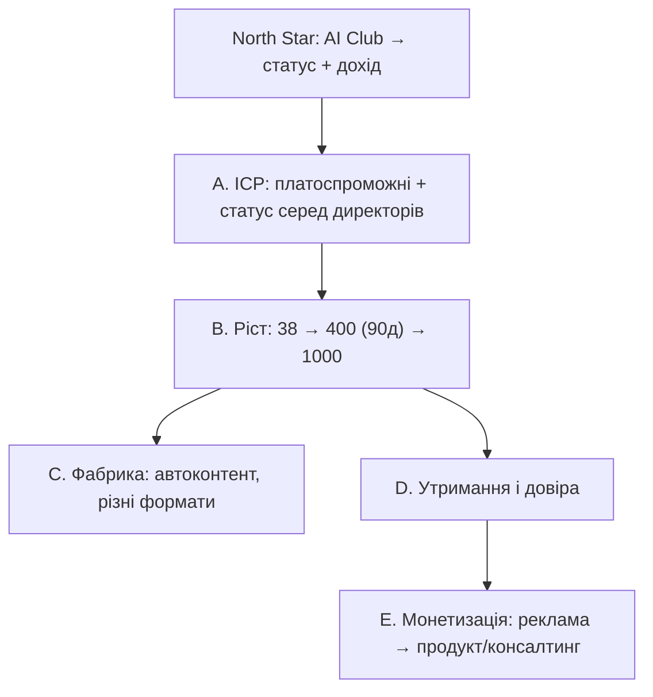

# AI Club: ціль, декомпозиція і стратегія до 1 000 підписників

**Канал:** [t.me/xainaiclub](https://t.me/xainaiclub)  
**Лінійний проєкт:** [AI Club Media](https://linear.app/xainshome/project/ai-club-media-eecc9bfbd289/overview)  
**Контекст:** AI/LLM у бізнесі; досвід з практики IT (у т.ч. контекст Onix) без корпоративного позиціонування каналу  
**Горизонт фази 1:** **2026-08-08 → 2026-11-06** → **≥ 400 підписників**  
**Горизонт довгостроковий:** **1 000 підписників** (після успішної 90-денної фази)  
**Executable план:** [`03-executable-plan-90d.md`](./03-executable-plan-90d.md)  
**Статус:** цілі скориговано; фокус на content factory + 2–4 год/тиждень

---

## 1. Поточна точка

| Параметр | Зараз |
|----------|--------|
| Підписники | ~38 |
| Мова | українська |
| Бренд | **AI Club** — особистий актив |
| Публічна роль автора | CEO-ракурс **дозволено** (гнучко); досвід в IT з 23 років |
| Бюджет часу | **2–4 год / тиждень** |
| Грошовий бюджет (2 міс.) | час + до **$100** за потреби |
| Старий bio (до ревізії) | «ШІ для IT аутсорсингових компаній з точки зору CEO» |

**Gap фази 1:** +~362 за 90 днів ≈ **~4 нетто/день** або **~28 нетто/тиждень** (після foundation).

При 2–4 год/тиждень — через **content factory** + мінімальний LinkedIn, не ручний щоденний SMM.

---

## 2. Зафіксовані рішення (з відповідей)

| # | Рішення |
|---|---------|
| Бренд | AI Club = **особистий** медіа-бренд |
| Роль автора | CEO-ракурс **можна** афішувати; правила гнучкі на старті |
| Актив | канал — особистий, не маркетинг Onix |
| Мова | **лише UA** на горизонті 2 міс. |
| OKR 90 днів | **≥ 400 підписників**; **якість аудиторії** — основний упор |
| OKR довгостроковий | **1 000** — після фази 90 днів |
| Час | 2–4 год/тиждень особисто |
| Операційна модель | максимально **автоматизувати фабрику контенту**, різні формати новин (окремі задачі) |
| Монетизація (після довіри) | **реклама** першою; далі можливо **свій продукт** або **консалтинг** |
| Дистрибуція Onix | під питанням; **можна** особисті соцмережі автора |
| Старт | **2026-08-08**; дедлайн фази 1 **2026-11-06** |
| Фокус зараз | **content factory** + контент, який подобається автору; реклама — у майбутньому |

### Що ціль *не є*

- Не корпоративний канал Onix і не lead-gen воронка Onix у перші 2 місяці.
- Не «одразу 10K і прайс на рекламу» — наступний горизонт після 1K + якості.
- Не ручна контент-ферма на повному дні автора — ставка на автоматизацію.

---

## 3. Фінальне формулювання цілі

### Північна зірка (North Star)

> Побудувати особистий медіа-бренд **AI Club** навколо AI/LLM у бізнесі, який дає **впізнаваність**, **статус серед директорів/рішеньників** і з часом **дохід** (реклама → продукт/консалтинг).

### OKR на 90 днів (зафіксовано)

> До **2026-11-06** канал [@xainaiclub](https://t.me/xainaiclub) має **≥ 400 підписників**, контент українською, бренд особистий (AI Club). Ріст з **пріоритетом якості** ICP (уточнюється паралельно). Особистий час автора ≤ **4 год/тиждень**; виробництво — **content factory** + авторський шар (Lab, думка, approve).

### OKR довгостроковий

> **1 000 підписників** — ціль після успішної 90-денної фази та стабільного контент-ритму.

### Ключове напруження (свідомо)

| Обмеження | Наслідок для стратегії |
|-----------|------------------------|
| 400 за 90 днів | реалістичніше при 2–4 год/тиждень + factory |
| 2–4 год/тиждень | автор = редактор/стратег, не «пишіть 20 постів руками» |
| Якість > накрутка | дистрибуція в місцях, де сидить платоспроможний ICP |
| ICP ще не досліджений | перші 1–2 тижні: гіпотеза ICP + міні-дослідження паралельно з foundation |

---

## 4. Декомпозиція цілі

### A. Аудиторія (ICP) — *потребує окремого дослідження*

**Зафіксовані критерії якості (поки без точного портрета):**

1. **Платоспроможна** аудиторія (потенціал реклами / продукту / консалтингу).
2. Аудиторія, яка **підтверджує досвід і статус** автора перед директорами інших компаній (соціальний доказ для майбутніх колаборацій).
3. Тема інтересу: **AI/LLM і застосування в бізнесі**.

**Робоча гіпотеза ICP (до дослідження, не догма):** керівники та рішеньники в IT / digital-бізнесі в UA, які впроваджують або купують AI-рішення; вторинно — ті, хто впливає на бюджет і tooling.

**Окремі deliverables (наступні задачі):**

- [ ] Маркетингове дослідження ICP для AI Club  
- [ ] Дослідження «статус перед директорами»: хто саме, які сигнали довіри, який контент це будує  

Поки дослідження не закрите — контент і промо цілимо в гіпотезу вище, без розмиття на «усіх, хто любить ChatGPT».

**Обіцянка каналу (чернетка, UA, без CEO-титулу):**

> AI Club — практичний погляд на AI в бізнесі від людини з довгим IT-досвідом: що варто брати, що — хайп, і як застосовувати без ілюзій.

### B. Ріст до 1 000

Ріст = **офер × дистрибуція × фабрика × довіра**.

| Важіль | Рішення |
|--------|---------|
| Офер | особистий AI Club, UA, бізнес-практика AI — не сирий news-агрегатор |
| Дистрибуція | особисті соцмережі + нішеві точки входу; Onix-канали — лише якщо пізніше «так» |
| Фабрика | автоматизація збору/пакування новин у різні формати |
| Час автора | 2–4 год: пріоритет — відбір, голос, дистрибуція, рішення; не верстка кожного поста з нуля |
| Бюджет $100 | точечно на те, що дає вимірюваних підписників (після перших тестів) |

**Орієнтир воронки (тиждень):**

| Етап | Цілі |
|------|------|
| Нетто підписок | **≥ 120** |
| Early warning | < ~80 нетто два тижні поспіль → pivot дистрибуції |
| До 2026-10-08 | ≥ 1 000 total |

### C. Фабрика контенту (стратегічна ставка під час-бюджет)

Окремий блок робіт (не розписаний тут як тактика):

- джерела сигналів (новини, релізи, papers, практика);
- пайплайн: зібрати → відфільтрувати під ICP → упакувати в формати → опублікувати;
- формати: короткий сигнал, дайджест, розбір, чекліст тощо;
- роль автора: фінальний голос / «і що з того бізнесу», не сирий рерайт.

Без фабрики OKR при 2–4 год/тиждень майже напевно зірветься.

### D. Утримання

1 000 мають бути живими для майбутньої реклами.

Мінімум на горизонті 2 міс.:

- стабільні реакції / пересилки на якірні пости;
- контроль відписок;
- тон і користь узгоджені з майбутньою рекламою (не «сміттєвий трафік»).

### E. Дохід (після 1K / паралельно як напрямок)

| Пріоритет | Модель | Що не ламати в перші 2 міс. |
|-----------|--------|------------------------------|
| 1 | Реклама / інтеграції | чистота ніші, якість аудиторії, медіакіт-чернетка |
| 2 | Свій продукт | збирати питання/болі аудиторії |
| 3 | Консалтинг | статус і довіра директорів (див. дослідження) |

Ліди в Onix **не** є ціллю каналу на цьому етапі.

---

## 5. Стратегія на 2 місяці (принципи)

Тактика (календар, інструменти, промпти фабрики) — наступний документ.

### Ставка 1. Особистий бренд, не корпоративний голос

- Byline і bio без акценту на CEO Onix.
- Досвід і розбори — від першої особи / від AI Club.
- Згадки робочого контексту — обережно, як досвід, не як пресслужба компанії.

### Ставка 2. Ніша вужча за «всі AI-новини»

Диференціація: бізнес-застосування + довгий IT-досвід + UA-аудиторія рішеньників.  
Сирий агрег новин без «навіщо це бізнесу» — не стратегія.

| Тип | Призначення | Частка (старт) |
|-----|-------------|----------------|
| Сигнал / новина + бізнес-висновок | захід, шери | ~40% |
| Розбір практики | довіра, статус | ~35% |
| Фреймворк / чекліст | збереження, пересилка | ~15% |
| Особистий голос / процес навчання | бренд | ~10% |

### Ставка 3. Ріст через дистрибуцію + особисті соцмережі

1. Особисті соцмережі автора — основний дозволений підсилювач.  
2. Нішеві чати/спільноти UA IT / AI / бізнес — цінний перший дотик, без спаму.  
3. Крос-промо з суміжними каналами.  
4. Один «магніт» підписки (напр. щотижневий UA AI Brief для бізнесу).  
5. Onix-аудиторія — **не використовуємо**, доки немає явного «так».

### Ставка 4. Автоматизація як умова OKR

Фази робіт над фабрикою йдуть **паралельно** з ростом, інакше час-бюджет не сходиться.

### Ставка 5. Дві фази календаря

| Фаза | Дати (орієнтир) | Фокус | Критерій |
|------|-----------------|--------|----------|
| **Foundation** | 08.08–21.08 | bio/офер без CEO-титулу; гіпотеза ICP; старт дослідження; вітринний контент; трекінг; каркас фабрики | канал зрозумілий за 10 сек; є baseline |
| **Growth** | 22.08–08.10 | щотижневі петлі дистрибуції + якір; масштабувати те, що дає якісних підписників; $100 — лише на доведені канали | траєкторія на 1K / pivot |

### Ставка 6. Якість при фіксованих 1 000

Накрутки, офтоп-трафік і клікбейт, що вбиває майбутню рекламу/статус — **поза стратегією**.  
Якщо конфлікт «швидкі підписники vs якість» — сповільнюємо брудний ріст, але **не знімаємо** ціль 1 000; шукаємо чистіші петлі.

---

## 6. Метрики (scoreboard)

| Метрика | Ціль до 2026-10-08 | Нотатка |
|---------|-------------------|---------|
| Підписники | ≥ 1 000 | фіксований OKR |
| Нетто/тиждень | ≥ 120 (середнє) | early warning < 80 |
| Час автора | ≤ 4 год/тиждень | жорстке обмеження дизайну системи |
| Мова | UA | |
| ICP fit | якісно, після дослідження — з % | research = окрема задача |
| Джерела росту | top-3 відомі | масштабувати |
| Бюджет кешем | ≤ $100 | optional, після тестів |

---

## 7. Відповіді (зафіксовано) і відкриті питання

### 7.1. Відповіді на ключові питання

1. **Роль:** досвідчений в IT з 23 років; AI Club — особистий бренд; CEO не афішуємо.  
2. **Актив:** особистий.  
3. **Мова:** UA.  
4. **ICP:** потрібні окремі дослідження (платоспроможність + статус перед директорами).  
5. **1 000:** фіксована ціль; упор на якість.  
6. **Час:** 2–4 год/тиждень; ставка на автоматизовану фабрику і різні формати.  
7. **Дохід:** реклама → можливо продукт / консалтинг.  
8. **Onix для росту:** під питанням; особисті соцмережі — так.  
9. **Бюджет:** час + до $100.  
10. **Старт:** 2026-08-08 (дедлайн 2026-10-08).

### 7.2. Ще варто закрити (коротко, коли буде час)

- Список особистих соцмереж і їхній пріоритет для дистрибуції.  
- 20–50 точок входу (чати/канали/люди) на тиждень 1–2.  
- Які формати новин фабрика має вміти першими.  
- Що з робочого досвіду можна/не можна публікувати без корпоративного ризику.  
- Червоний список тем (політика тощо).

---

## 8. Наступні документи / задачі

1. **Executable план 90 днів:** [`03-executable-plan-90d.md`](./03-executable-plan-90d.md)  
2. **Content factory v0** — джерела, шаблони, digest (Linear)  
3. **ICP research** — паралельно, не блокер старту  
4. Ревізія **bio / pinned / 5 evergreen** (тиждень 1–2)

---

## Посилання

- Канал: https://t.me/xainaiclub  
- Onix (контекст досвіду, не бренд каналу): https://onix-systems.com  
- Linear: https://linear.app/xainshome/project/ai-club-media-eecc9bfbd289/overview  
