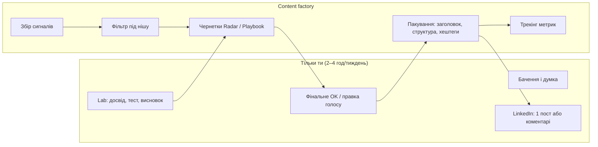

# AI Club: executable план на 90 днів (2–4 год/тиждень)

**Канал:** [@xainaiclub](https://t.me/xainaiclub)  
**Старт:** 2026-08-08  
**Дедлайн фази:** 2026-11-06  
**Повний досліджувальний документ:** [`xainaiclub_growth_strategy_1000.md`](./xainaiclub_growth_strategy_1000.md)  
**Linear:** [AI Club Media](https://linear.app/xainshome/project/ai-club-media-eecc9bfbd289/overview)

---

## 1. Що зафіксували зараз

| Рішення | Значення |
|---------|----------|
| OKR 90 днів | **≥ 400 підписників** (якість важливіша за швидкість) |
| OKR довгостроковий | **1 000** — після успішної фази 90 днів |
| Час автора | **2–4 год / тиждень** |
| Фокус зараз | **контент-система + фабрика**, не монетизація |
| Реклама в каналі | колись у майбутньому, не зараз |
| Роль | **CEO** можна афішувати (гнучко) |
| Правила | **мінімум жорсткості** — стартуємо швидко, уточнюємо в процесі |
| Обовʼязково | **content factory** в будь-якому разі |

### Що беремо з великої стратегії

- ніша: **AI для IT-сервісних компаній** (аутсорс / delivery / ops)
- **Lab** як доказ (власний досвід, тест, висновок)
- фільтр: **новина без бізнес-рішення → не публікуємо**
- **pinned** + **5 evergreen** матеріалів
- **LinkedIn** — верх воронки
- **якість > накрутка**

### Що свідомо не беремо на старті

- 6–10 год/тиждень і великі редакції
- 16 постів/місяць
- жорсткий CEO-only брендбук
- агресивні вебінари / партнерства як умова старту
- продаж реклами до досягнення довіри

---

## 2. Одне речення (компас)

> **AI Club — практичний погляд CEO на те, як ШІ змінює delivery, економіку й ризики IT-сервісної компанії; з власними тестами замість переказу хайпу.**

---

## 3. Мінімальний контент-продукт

Не «щоденна стрічка», а **3 шари**:

| Шар | Що це | Частота | Хто робить |
|-----|--------|---------|------------|
| **Radar** | 1 сигнал → вплив на бізнес → дія тижня | 1–2× / тиждень | Фабрика чернетка → ти **30–45 хв** правки/голос |
| **Lab** | власний тест / спостереження / цифра / артефакт | 1× / 2 тижні | **Ти** (думка, досвід) → фабрика пакує в пост |
| **Playbook** | чекліст, матриця рішень, шаблон | 1× / місяць | Фабрика з твого outline або з Lab |

**Максимум публікацій:** ~**6–8 / місяць** (не 16).

### Редакційний фільтр (1 питання)

Перед публікацією:

> *Яке **бізнес-рішення** читач може прийняти після цього поста?*

Якщо відповіді немає — не публікуємо (або переробляємо в Radar з блоком «дія»).

---

## 4. Людина vs автоматизація



### Залишається за тобою

- що важливо / не важливо (редакційний смак)
- Lab: що тестував, що зламалось, що думаєш
- фінальне «так / ні» перед публікацією
- особисті історії, позиція, сміливі висновки
- 1 дотик LinkedIn на тиждень (або батч раз на 2 тижні)

### Автоматизуємо максимально

- моніторинг джерел (RSS, X, newsletters, DOU, конкуренти)
- відбір «кандидатів у Radar» за ключовими темами
- чернетка поста за шаблоном Radar
- перепакування Lab у структурований пост
- календар / черга публікацій
- трекер: views, forwards, підписники, джерела (invite links)
- нагадування «тижневий review 30 хв»

### Content factory v0 (перший спринт)

**Мета:** щоб ти витрачав час на **думку**, а не на «знайти новину і відформатувати».

| Крок | Deliverable |
|------|-------------|
| 1 | Список 15–25 джерел сигналів (новини, блоги, конкуренти) |
| 2 | 3 промпти-шаблони: Radar, Lab, Playbook |
| 3 | Щоденний/щотижневий digest кандидатів у Telegram або Notion |
| 4 | Черга «чернетка → твій review → publish» |
| 5 | 1 invite link для LinkedIn + 1 для «особисті контакти» |

Детальна архітектура фабрики — окрема задача в Linear (після v0).

---

## 5. Тижневий ритм (2–4 год)

| Блок | Час | Дія |
|------|-----|-----|
| **Review factory** | 45–60 хв | Пройти 3–5 чернеток Radar; дописати голос; approve 1–2 пости |
| **Lab** | 45–60 хв | Голосова нотатка / bullet points досвіду → фабрика пакує **або** правка готового Lab-поста |
| **LinkedIn** | 30–45 хв | 1 пост з тезою каналу + посилання; 2–3 коментарі в релевантних тредах |
| **Metrics** | 15–30 хв | Підписники, топ-пост, що зростає; 1 рішення «подвоїти / прибрати» |

**Якщо тиждень завантажений:** мінімум = 1 Radar (з фабрики + 20 хв правки) + 15 хв metrics. Lab переноситься, але не скасовується два тижні поспіль.

---

## 6. План 90 днів: 38 → 400

| Етап | Тижні | Ціль підписників | Фокус |
|------|-------|------------------|--------|
| **Foundation** | 1–2 | 80–100 | bio, pinned, 5 evergreen, factory v0, перші 2 Radar |
| **Rhythm** | 3–6 | 180–250 | стабільний ритм 1–2 Radar/тиждень + 2 Lab |
| **Distribution** | 7–10 | 300–350 | LinkedIn цикл + 1–2 м’які партнерські згадки |
| **Consolidate** | 11–13 | **400** | подвоїти те, що дає якісних підписників; міні-опитування ICP |

**Нетто/тиждень (орієнтир):** ~25–30 після foundation (не 120 як у старому 2-місячному плані).

Якість: краще **320 релевантних**, ніж 400 випадкових — але 400 лишається ціллю з акцентом на ICP.

---

## 7. Foundation (тижні 1–2) — чекліст

- [ ] **Display name:** `AI для IT-сервісу | XAI` (handle `@xainaiclub` не чіпаємо)
- [ ] **Bio:** практичний ШІ для керівників IT-сервісу; CEO-ракурс; без обіцянки «всі новини»
- [ ] **Pinned post:** навігація + 5 посилань на evergreen (можна з архіву після легкої правки)
- [ ] **5 evergreen:** 2 Lab-матеріали з архіву + 3 нові/перепаковані Radar або Playbook
- [ ] **Рубрики в постах:** `#CEO_Radar` `#AI_Lab` `#Playbook` (не більше 3 на старті)
- [ ] **Factory v0:** джерела + шаблони + digest
- [ ] **Invite links:** LinkedIn, особисті контакти
- [ ] **3 опитування в каналі** (роль, розмір компанії, головний AI-виклик) — коли буде 50+ підписників або раніше вручну

---

## 8. LinkedIn (мінімум, без окремого SMM)

1 пост / тиждень за формулою:

```text
Теза (конфлікт або цифра)
→ 3 буллети «що це змінює для IT-сервісу»
→ CTA: повний розбір / Lab у Telegram
```

Не дублювати весь Telegram. LinkedIn = гачок; Telegram = глибина.

---

## 9. Метрики (15 хв / тиждень)

| Метрика | Навіщо |
|---------|--------|
| Підписники (нетто) | траєкторія до 400 |
| Views на останні 5 постів | що резонує |
| Forwards / reactions | сигнал якості |
| Джерело (invite link) | що масштабувати |
| 1 qualitative note | хто написав / що запитали |

Після **50 підписників** — [XAI-5](https://linear.app/xainshome/issue/XAI-5): Telegram Statistics.

---

## 10. Перші 10 дій (порядок)

1. Оновити **name + bio** каналу.
2. Написати **pinned** (чернетка в фабриці → твоя правка).
3. Вибрати **5 evergreen** з архіву (див. топ views у дослідженні).
4. Запустити **factory v0**: джерела + 1 шаблон Radar.
5. Опублікувати **2 Radar** (фабрика + твій голос).
6. Записати **1 Lab** голосом (5–10 хв) → фабрика пакує.
7. **1 пост LinkedIn** з посиланням на найсильніший матеріал.
8. Створити **2 invite links** (LinkedIn / особисті).
9. Зафіксувати **щотижневий слот** 2–4 год (один день у календарі).
10. Через 2 тижні — **review**: що автоматизувати далі.

---

## 11. Що далі (після 90 днів)

- якщо **≥ 400** і стабільний ритм → планувати фазу **400 → 1000** (більше партнерств, 1 benchmark, реклама пізніше)
- якщо **< 300** → не ламати нішу; посилити LinkedIn + Lab, не частоту
- **ICP research** — паралельно, не блокер старту
- **Content factory v1** — агенти, n8n, автопостинг (окремий технічний спринт)

---

## Посилання

- Стратегія (коротка): [`01-goal-and-strategy-1000-subscribers.md`](./01-goal-and-strategy-1000-subscribers.md)  
- Конкуренти: [`02-competitors-ua-telegram-ai.md`](./02-competitors-ua-telegram-ai.md)  
- Повне дослідження: [`xainaiclub_growth_strategy_1000.md`](./xainaiclub_growth_strategy_1000.md)
