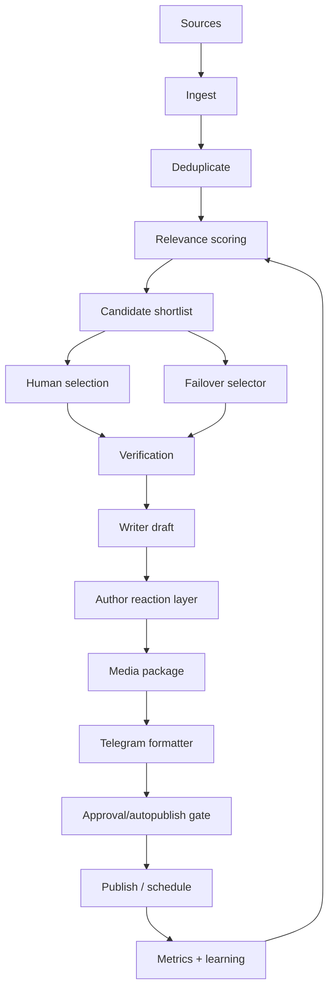

# AI Club news factory v1: 1-2 Telegram news posts daily

Дата: 2026-08-10  
Канал: [@xainaiclub](https://t.me/xainaiclub)  
Linear: [XAI-14](https://linear.app/xainshome/issue/XAI-14/news-factory-v1-1-2-telegram-novini-shodnya-z-avtorskoyu-reakciyeyu)

## 1. Executive summary

Мета v1: побудувати максимально автоматизовану фабрику, яка щодня знаходить 10-20 AI-сигналів, відбирає 3-5 кандидатів, готує 1-2 Telegram-ready пости українською з ілюстрацією та авторською реакцією Serhii, а далі або чекає вибору/approval автора, або в обмеженому failover-режимі публікує сама.

Ключова зміна від попереднього позиціонування: фокус тимчасово зміщується з довгої стратегії ICP на виробничу систему новин. Але фабрика не має перетворити AI Club на масовий агрегатор. Правильний продукт: **не "AI-новини", а AI-новина + що це означає для IT-сервісу + моя реакція**.

Рекомендований режим запуску:

1. **Author-selected**: агент щодня приносить короткий shortlist, автор вибирає 1-2 теми.
2. **Author-approved**: агент готує повний пост і media package, автор тисне approve/edit/reject.
3. **Agent-autopublish failover**: агент сам публікує тільки якщо автор не відповів, тема має високий score, є первинне джерело, немає legal/security/rumor ризику, і пост не містить сильних прогнозів від першої особи.

Мій висновок: починати треба з режиму 1+2. Режим 3 варто ввімкнути лише після 10-14 успішних публікацій і ручного review якості, і лише для "safe news" без репутаційного ризику.

## 2. What we know from prior work

### Documents read

- [`01-goal-and-strategy-1000-subscribers.md`](./01-goal-and-strategy-1000-subscribers.md): AI Club як особистий медіа-бренд, ставка на content factory, 2-4 год/тиждень автора.
- [`02-competitors-ua-telegram-ai.md`](./02-competitors-ua-telegram-ai.md): ринок UA AI Telegram уже має масові новинні канали, тому AI Club не має змагатися в "всі AI-новини для всіх".
- [`03-executable-plan-90d.md`](./03-executable-plan-90d.md): Radar/Lab/Playbook, правило "немає бізнес-рішення -> не публікуємо", factory v0 як перший спринт.
- [`04-ua-ai-media-landscape-deep-research.md`](./04-ua-ai-media-landscape-deep-research.md): white space для operator-grade curation: переклад AI-сигналів у наслідки для CEO/COO/Delivery/Sales IT-сервісу.
- [`05-audience-icp-research.md`](./05-audience-icp-research.md): Primary ICP хоче decision support, а не шум; формула поста: сигнал -> вплив -> дія -> оцінка автора.
- [`xainaiclub_growth_strategy_1000.md`](./xainaiclub_growth_strategy_1000.md): аудит каналу показав, що сильні формати мають власний тест, авторський висновок або CEO-переклад новини; слабкі формати - голі репости, дублювання і широкий dev/tooling шум.

### Public channel audit

Останній публічний зріз `https://t.me/s/xainaiclub` показує сильну сторону каналу: Serhii вже пише живим голосом, додає особисту оцінку і добре пояснює agentic engineering / coding tools / security incidents. Але видно і ризики:

- повторні репости без єдиного пакування;
- новини різної ваги стоять поруч без scoring;
- частина текстів має сильний dev/tooling фокус без явного business takeaway;
- ілюстрації й оформлення нерівні;
- авторська реакція часто є найціннішою частиною, тому її не можна "стерти" автоматизацією.

### DRAFT Group Club AI

Індексовані session transcripts і видимі сесії не дали доступу до чату `[DRAFT] Group Club AI`. Тому цей план спирається на наявні документи, Linear-історію, публічний канал і зафіксований workflow `club-ai-news-pipeline`: research writer -> Telegram formatter -> approval gate. Після появи доступу до draft-чату варто зробити короткий update до розділу "Voice memory".

## 3. Product definition

### Daily output

- 1-2 Telegram posts per day.
- Ukrainian.
- Each post includes:
  - headline;
  - what happened;
  - why it matters for IT-service/business/operator audience;
  - Serhii reaction;
  - source link(s);
  - visual: original media, screenshot, chart card, or generated image;
  - 3-5 relevant hashtags only when useful.

### Editorial promise

> Я читаю AI-ринок замість вас і публікую тільки ті сигнали, де є управлінський висновок для IT-сервісу, delivery, sales, маржі, ризиків або команди.

### Non-goals

- Не агрегувати всі AI-новини.
- Не копіювати пости конкурентів.
- Не публікувати unverified rumors як факти.
- Не видавати агентський текст за сильну особисту позицію автора без author signal.
- Не публікувати автоматично sensitive теми: security incidents, lawsuits, layoffs, acquisition rumors, model benchmark claims без первинного джерела.

## 4. Operating modes

| Mode | Хто вибирає тему | Хто затверджує текст | Коли використовувати | Ризик |
|---|---|---|---|---|
| **A. Author-selected** | Serhii | Serhii | Default на старті | Низький |
| **B. Author-approved** | Agent пропонує top 3-5 | Serhii | Default після першого тижня | Низький-середній |
| **C. Agent-autopublish failover** | Agent | Agent за guardrails | Тільки якщо автор мовчить і треба зберегти ритм | Середній-високий |

### Approval UX

Щодня агент надсилає в робочий чат:

```text
News shortlist for AI Club

1. [score 8.7] Anthropic ships X
Why it matters: delivery/tool policy
Author angle: "це зсуває роль PM ближче до agent manager"
Risk: low

2. [score 7.9] OpenAI security incident write-up
Why it matters: sandbox/governance
Author angle: "AI security testing має бути production-grade"
Risk: medium

Reply:
publish 1
draft 1+2
skip 2
more like 1
```

Після вибору агент готує full package:

```text
POST PACKAGE

Status: needs approval
Source confidence: high / medium / low
Visual: original screenshot / generated card / no visual
Autopublish eligible: yes/no + reason

Telegram post:
...

Buttons:
approve
edit: ...
reject
```

## 5. News pipeline architecture



### Stage 1: Sources

Start with 30-50 sources split by reliability:

| Tier | Sources | Use |
|---|---|---|
| Primary | OpenAI, Anthropic, Google DeepMind, Meta AI, Microsoft, GitHub, Cursor, Hugging Face, model/system cards, pricing/docs/changelogs | Facts and final links |
| Technical signal | DOU AI, AI HOUSE, Fwdays, Addy Osmani, Simon Willison, Latent Space, The Batch, AI Engineering, vendor engineering blogs | Topic discovery |
| Market signal | The Information, Bloomberg, Reuters, TechCrunch, AIN, dev.ua, Forbes Ukraine, SPEKA, Vector | Business context |
| Telegram peers | DOU AI, make ai., llms_ua, Claude Code Україна, Нештучний інтелект, EV щоденник | Watchlist and distribution awareness |
| X/Twitter | founders, researchers, engineers, investors | Early signal only; verify elsewhere |

Do not publish a claim from Tier 3-5 without primary or high-trust secondary confirmation.

### Stage 2: Scoring

Score each candidate 0-10:

| Criterion | Weight | Question |
|---|---:|---|
| IT-service impact | 30% | Чи впливає на delivery, margin, sales, staffing, security, client expectations? |
| Author fit | 20% | Чи може Serhii додати власний operator/CEO angle? |
| Source confidence | 15% | Є primary source чи тільки переказ? |
| Timeliness | 10% | Чи важливо це сьогодні/цього тижня? |
| Visual potential | 10% | Чи можна зробити сильну картку/скрин/ілюстрацію? |
| Novelty vs channel | 10% | Чи не дублює попередній пост? |
| Discussion potential | 5% | Чи може викликати replies/forwards від керівників? |

Autopublish threshold: **>= 8.0**, source confidence high, risk low, no strong unverified claims.

### Stage 3: Verification

Mandatory checks:

- primary source exists or caveat is explicit;
- dates and product/model names are correct;
- benchmarks are labeled as vendor/third-party/internal;
- pricing is checked from current docs when available;
- no fake screenshots or AI-generated "evidence";
- no confidential data in screenshots;
- no copied paragraphs from paid/newsletter sources;
- if story is rumor/opinion/PR, label it.

### Stage 4: Writing

Default template:

```text
Headline

Що сталося:
1-3 речення.

Чому це важливо:
Impact on delivery / margin / sales / people / risk.

Моя реакція:
Коротко від першої особи. Що я би робив / чого не робив / де пастка.

Дія:
1 маленький крок для CEO/CTO/Delivery this week.

Джерело:
link
```

Tone:

- short, direct, Ukrainian;
- CEO/operator perspective;
- no generic hype;
- irony allowed, but not at the cost of clarity;
- if uncertain, say uncertain.

### Stage 5: Author reaction layer

Best input: Serhii sends one of:

- picks a news item from shortlist;
- one-line reaction: "це про PM -> agent manager";
- voice note with raw opinion;
- quick instruction: "публікуй як warning для delivery/security";
- emoji/short reply can be mapped only to low-risk tone, not factual claims.

If no reaction is available, agent can use a **soft reaction**:

```text
Мій висновок тут простий: це варто сприймати не як окрему фічу, а як сигнал до ...
```

Agent must not invent personal experience like "ми вже так зробили в Onix" unless Serhii explicitly provided it.

### Stage 6: Media package

Priority order:

1. Original attached media from source, if allowed and useful.
2. Screenshot of primary announcement/docs/pricing/table.
3. Simple 1:1 Telegram card with headline + one number/quote.
4. Generated illustration only when the story has no usable visual and the image is clearly illustrative.
5. No image if visual would be decorative noise.

Visual rules:

- avoid generic AI robot art;
- use charts, product screenshots, model/pricing tables, architecture snippets;
- image must support the claim, not just decorate;
- generated images must not imply real evidence;
- for security/legal incidents, prefer source screenshot or neutral card.

## 6. Technical MVP

### MVP in 7 days

| Day | Deliverable |
|---:|---|
| 1 | Source list v1: 30-50 sources, RSS/API/manual URLs, priority tags |
| 2 | Scoring prompt + candidate JSON schema |
| 3 | Daily shortlist generation in working chat |
| 4 | Writer + Telegram formatter prompts using existing `club-ai-news-pipeline` |
| 5 | Media package rules + first card template |
| 6 | Approval commands: approve/edit/reject/schedule |
| 7 | Metrics sheet/table + first weekly review |

### Suggested data model

```json
{
  "id": "2026-08-10-openai-agent-security",
  "source_url": "https://...",
  "source_type": "primary",
  "title": "...",
  "summary": "...",
  "score": 8.4,
  "risk": "medium",
  "confidence": "high",
  "impact_axes": ["security", "delivery", "governance"],
  "author_angle": "...",
  "media_plan": "source screenshot",
  "status": "candidate|drafted|approved|scheduled|published|rejected",
  "published_url": null
}
```

### Storage

For the first repo-only planning phase, Markdown is enough. For implementation, state should move to a structured store:

- candidates;
- drafts;
- approval status;
- published links;
- source performance;
- content metrics.

If this becomes OpenClaw-owned runtime state later, use SQLite/plugin KV rather than JSON files.

## 7. Automation prompts

### Candidate screener

```text
You are the AI Club news screener.
Evaluate this AI news item for a Ukrainian Telegram channel for IT-service founders/CEO/COO/Delivery/CTO.

Return:
- one-sentence summary
- primary source
- why it matters for IT-service
- author angle Serhii could take
- score 0-10 using the rubric
- risk: low/medium/high
- autopublish eligible: yes/no and why
```

### Writer

Use the existing `club-ai-news-pipeline` Agent 1 role, with one addition:

```text
The post must include Serhii's reaction. If Serhii gave no explicit reaction, write a soft operator reaction without pretending personal experience.
```

### Formatter

Use the existing Telegram Formatter role. Keep posts compact; do not overuse emojis or hashtags.

## 8. Metrics

Daily:

- candidates found;
- candidates shortlisted;
- posts published;
- author actions: approve/edit/reject/no response;
- time from signal to post;
- autopublish used yes/no.

Post-level:

- views at 1h / 24h / 7d;
- reactions;
- forwards;
- replies;
- new subscribers if available;
- source category;
- score vs actual performance;
- whether post had author reaction / soft reaction.

Weekly decision:

- keep/remove sources;
- which impact axis worked: delivery, margin, sales, risk, people;
- which media type worked;
- whether autopublish quality is acceptable;
- 3 examples of "more like this", 3 examples to avoid.

## 9. Guardrails for autopublish

Autopublish is allowed only when all conditions are true:

- score >= 8.0;
- source confidence high;
- risk low;
- no rumor, leak, legal claim, security accusation, funding/ARR claim without source;
- no first-person claim about Serhii's direct experience unless provided;
- no use of private/corporate/client info;
- media is safe and non-misleading;
- the post has a clear business takeaway;
- maximum 1 autopublished post per day until quality is proven.

Autopublish is forbidden for:

- scandals, accusations, security incidents with unclear facts;
- layoffs, deaths, war/politics, lawsuits;
- posts criticizing named Ukrainian companies or people;
- investment/valuation rumors;
- sponsored/vendor claims without independent context;
- generated images that could be mistaken for evidence.

## 10. Backlog

### P0

- Create source registry.
- Implement daily shortlist.
- Create scoring rubric and JSON candidate shape.
- Prepare 2 post templates: short Radar and deep Radar.
- Add approval commands.
- Define media package rules.

### P1

- Add image/card generator.
- Add metrics tracker.
- Add weekly learning report.
- Add duplicate detection against last 14 channel posts.
- Add source reliability labels.

### P2

- Add scheduling.
- Add autopublish failover.
- Add LinkedIn repackaging.
- Add monthly digest.
- Add voice-note-to-reaction flow.

## 11. First 14 days

### Week 1: controlled manual factory

- 5 daily shortlists.
- 5-8 drafted posts.
- 3-5 published posts.
- 0 autopublish.
- Record edit distance: how much Serhii changes agent drafts.

### Week 2: author-approved rhythm

- 7 daily shortlists.
- 7-10 drafted posts.
- 7-10 published posts if quality holds.
- Autopublish simulation only: agent marks what it would have published, but does not publish.
- End of week: decide whether failover can be enabled.

## 12. Success criteria

After 14 days:

- at least 10 quality candidates/day from sources;
- at least 1 publishable post/day without heroic manual work;
- author review time <= 15 minutes/day;
- factual corrections: 0 critical, <= 2 minor;
- at least 30% of posts get forwards/replies/reactions beyond baseline;
- Serhii accepts >= 60% of agent drafts with light edits;
- clear decision on whether autopublish is safe.

## 13. Open questions

1. Where should author approval happen: Telegram group, Linear, Notion, GitHub issue, or OpenClaw task UI?
2. Should publishing be immediate or scheduled at fixed windows?
3. Is generated imagery acceptable for AI Club, or should visuals mostly be screenshots/cards?
4. Which topics are red-listed for personal/corporate reputation?
5. Should the channel use a visible disclaimer for agent-assisted posts?
6. Who owns final responsibility if autopublish makes a factual mistake?

## 14. Recommendation

Build v1 as a **daily Radar machine with human taste**, not as a fully autonomous publisher. The right first milestone is not "agent posts instead of Serhii"; it is "Serhii spends 10-15 minutes/day choosing and approving, while the agent does 90% of discovery, fact-check, writing, formatting, and media prep".

Only after two weeks of measured quality should failover autopublish be enabled, and even then it should be boring, conservative, and easy to shut off.
